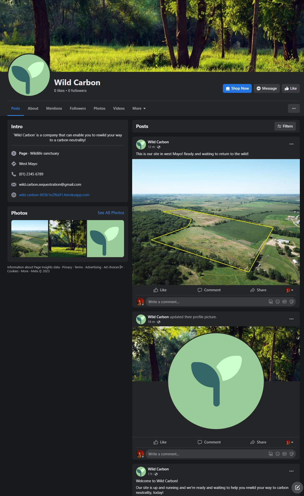

# **Wild Carbon**
[‘Wild Carbon’]( https://wild-carbon-803b1e2f6e91.herokuapp.com/) is a website (hosted on [Heroku](https://www.heroku.com/) and implemented with the aid of the Python Django framework) that’s for people who want to offset their carbon footprint and care about the environment.

Wild Carbon offers a service where users of the website can commission trees to be grown and planted on their behalf at Wild Carbon’s site in the west of Ireland. Once planted, the trees are allowed to grow in the protected, newly rewilded, site for the duration of the trees’ lives, gradually sequestering carbon for the people who commissioned them.

The company isn’t only about providing a carbon sequestration service,
. It’s also about rewilding, the return of areas that have been cultivated, perhaps for many years, to a wild state. This involves the planting of the commissioned native trees along with other flora that would have naturally inhabited the site. In turn, this replanting of the site encourages the return of the native fauna.

Sequestering carbon for the Wild Carbon customers whilst increasing the natural biodiversity of areas of land is the mission of Wild Carbon.

- [Link to live ‘Wild Carbon’ website]( https://wild-carbon-803b1e2f6e91.herokuapp.com/)


## **Contents**

1 [Project Initiation](#1-project-initiation)

2 [Wild Carbon development](#2-wild-carbon-development)

3 [Features](#3-features)

4 [Testing](#4-testing)

5 [Project Sign Off](#5-project-sign-off)

6 [Releases](#6-releases)

7 [Deployment](#7-deployment)

8 [Technologies Used](#8-technologies-used)

9 [Credits](#9-credits)

10 [Acknowledgements](#10-acknowledgements)


## **1. Project Initiation**

- ## Agile

    - ### Epics, User Stories and Tasks

        An agile approach was taken to the planning and implementation of the project. Epics were identified for the project from the basic requirements of an ecommerce store that would be selling the service of growing and planting trees to sequester carbon. As would be true of many e-commerce stores, these epics were the website, the shop functionality of the website and fulfillment management for orders placed.

        The epics were then refined into user stories, the user stories associated tasks and the acceptance criteria for the features developed to satisfy the user stories.

        As the project was planned, it was ensured that there was no functionality duplicated across features and that code could be reused wherever possible.

        As each user story was planned, new acceptance criteria were added to features as required for the user story in question to be satisfied. User stories were analysed in order of priority with functionality of later planned user stories building on the functionality of previously planned ones. This meant that the features functions that were worked on for later developed user stories were dependent on the earlier user stories being completed.

	    A stack of user stories in a kanban board was used to manage the order in which user stories were worked and ensure they were worked on in the correct order considering their priorities and interdependencies.  
        
        All feature acceptance criteria from all user stories were consolidated onto a single list from which a test plan could be produced.

        Note: During the planning and refinement phase, some features were combined with others and the feature ids of the features no longer required were removed from use, hence there are gaps in the feature id numbering system. No feature that is a requirement of the system has been omitted from the documentation.

        -   [Epics and User Stories](docs/pdfs/readme_epics.pdf)
        -   [Epic specifications](docs/pdfs/readme_epic_specifications.pdf)
        -   [Epic / User Story Acceptance Criteria](docs/pdfs/readme_epic_acceptance_criteria.pdf)
        -   [Consolidated Feature Acceptance Criteria](docs/pdfs/readme_feature_acceptance_criteria.pdf)

    - ### MoSCoW

        Once the design planning had taken place, the number of story points allocated to each user story was decided by considering the user storys’ tasks complexity and size. 

	    User stories were prioritised to ensure, firstly, the earliest possible return on investment for Wild Carbon followed by maximizing that return and lastly streamlining the fulfillment processes. In terms of the development of the software, this meant that the e-commerce part of the store being functional was the highest priority, followed by marketing for the company’s service to increase customer reach hence increasing the probability of making sales and, lastly, front end custom fulfillment functionality. Fulfillment functionality could easily be worked around in the standard Django admin pages should there be insufficient time to complete all fulfillment epic user stories. 

	    Using the MoSCoW technique all user stories were given a priority of 'must have', 'should have' or 'could have'. There were no ‘won't have’ user stories.

        -   [Iteration 1 MoSCoW Analysis](docs/pdfs/readme_moscow_analysis.pdf)

    - ### Agile tools

        Tools in GitHub were used to manage the project development phase. The user stories were entered as issues along with their associated tasks and acceptance criteria as well as the acceptance criteria for the features developed to satisfy the user stories.

        The user stories were given labels that indicated the epic they belonged to, their MoSCoW rating and the number of modified Fibonacci scaled story points that they had been allocated. 

        Initially the user stories (issues) were placed on the product backlog (implemented using a milestone) and were then moved onto the project Iteration 1 milestone when it was decided that they would be worked on during that iteration. The iteration was a 4 week period. 

        During the iteration, the user stories were managed in a GitHub project on a kanban board. As planned, in the order of priority, the user stories were moved from the 'ToDo' to 'In Progress' and, once complete, to 'Done. 

        Portion of Kanban

        

    - ### User Story / Task Prioritisation

        The order that the user stories were worked on was dependent on the MoSCoW priority along with the dependencies of each of the user stories. 

        The features and functionality of user stories moved into the ‘in progress’ column were often dependent on the completion of user stories worked on before them. These dependencies were ascertained during the project initiation/planning stage and the additional acceptance criteria required for each feature for the user story in question were appended to those defined for the user stories developed beforehand. By appending all new requirements to the bottom of the list of previous feature acceptance criteria, a full set of feature acceptance criteria was developed. 

        Example User Story

        

    - ### Acceptance Tests

        From this full feature set list and those features acceptance criteria, manual testing procedures were developed that would ascertain if the acceptance criteria for the user stories, all the features and therefore the project as a whole had been satisfied. 

        When it was believed that a user story development had been completed, the test script compiled to that point was run through to ensure that both the new set of tests for the most recent user story and those defined beforehand, for previous user stories, all passed as all the previous functionality was required for the new user story and any other user story that uses the feature the tests relate to.

## **2. Wild Carbon Development**

-   ## Business Model 

    Wild Carbon has a business to customer business model, where using a single payment model, they offer the service of growing and planting trees to order on the customers behalf. The planting of the trees is to sequester carbon from the atmosphere for the site user whilst rewilding and protecting the site on which the trees are planted.

    Made apparent by an ever increasing number of extreme weather events there is a greater awareness than ever of the climate shift that is taking place and the impact that most people’s lifestyles have on our environment. There has never been a better opportunity for this business to succeed in ‘making a difference’.

    -   ### Customers

        Wild Carbons customers are conscious of the impact that their lifestyle has on the environment both in terms of the carbon dioxide their lifestyle adds to the atmosphere but also the cultivation of the landscape for the production of food.

        The Wild Carbon service will appeal most to those who feel that there is an urgent need to try to restore our environment both in terms of the climate and areas of countryside. These people will often have the greatest vested interest in the future such as younger people and parents who care about the environment’s future for their children but it will also appeal to anyone who is conscious of the impact their life has had on the environment and would like to reverse this impact.

        The site would also appeal to residents of Ireland who are aware of the deforested nature of the country and would like to see more of Ireland returned to its natural state.

    -   ### Competition

        There is competition in the field of carbon sequestration through the planting of trees but very little to none, especially in Ireland, that offer it whilst focusing on rewilding the site as part of the process.

-   ## Marketing 
    The marketing strategy is currently fourfold:

    -   ### Search engine optimisation:

        Indexing of the site
        Optimising the website for search engines included the production of a robots.txt and sitemap.xml so that the site can be indexed appropriately.
        
        -   [robots.txt](https://wild-carbon-803b1e2f6e91.herokuapp.com/robots.txt)
        
        -   [The robots.txt file can be found here](https://github.com/Stephen-J-Whitaker/wild-carbon/blob/main/templates/robots.txt)
        
        -   [sitemap.xml]( https://wild-carbon-803b1e2f6e91.herokuapp.com/sitemap.xml)
        
        -   [The sitemap.xml file can be found here](https://github.com/Stephen-J-Whitaker/wild-carbon/blob/main/templates/sitemap.xml)
        
    -   ### Keywords
    
        Long and short tail keywords for Wild Carbon were researched on google and in [wordtracker.com]( https://www.wordtracker.com). These keywords have been included in the headers and in the content of the website, in the landing page content in particular. The success or failure of the keywords can be monitored in Google Analytics and, as necessary, the keywords can be left in place, altered or replaced.
    
        -   The keywords selected are:
        
            -   improve biodiversity
        
            -   carbon footprint

            -   carbon sequestration

            -   carbon offset

            -   rewild Ireland

            -   carbon neutral

            -   carbon neutrality

            -   offset my carbon footprint in Ireland

            -   wild carbon

            -   plant trees

            -   rewilding

            -   carbon calculator

            -   how do I sequester my life’s carbon footprint

    -   ### Other optimisation

        The site contains links to external sites with credibility and a high search engine ranking to help boost Wild Carbon’s own search engine ranking.
        File names and alt text are relevant. By providing useful links to credible external sites that will be of interest to the users of the site, search engine ranking will be improved.

        Internal URLs are relevant where possible. [for example: https://wild-carbon-803b1e2f6e91.herokuapp.com/locations/carbon_capture/]( https://wild-carbon-803b1e2f6e91.herokuapp.com/locations/carbon_capture/).

    -   ### Coming soon
    
        There is a ‘coming soon’ section on the landing page of the website detailing a future opportunity of sponsoring the preservation of areas of blanket bog to ensure the carbon locked within them remains there. This essentially offsets the customers carbon in a very cost effective way. 

        It is hoped that Customers will be encouraged by the coming soon section to sign up for the newsletter and return to the site on notification of the new service that they may be happier to avail of than the current tree commissioning service in place.

    -   ### Newsletter
    
        There is newsletter signup functionality incorporated into the landing page. 

        People who sign up for the newsletter will receive periodic information on subjects that are likely to be of interest to them. Subjects of interest would include, but are not limited to, useful hints on how to improve their carbon footprint going forward, any new initiatives that Wild Carbon are developing and events that Wild Carbon will be attending, (in case potential customers would like to meet staff members in person to help them feel confident in company and in turn its service).

    -   ### Social media

        Being a small startup company with no marketing budget currently and given the age group that the company’s rewilding carbon sequestration service will appeal to most, the company will be making the use of social media. 

        A Facebook business page has been set up that is linked to via a button in the footer of the website.

        -   [Wild Carbon’s Facebook business page](https://www.facebook.com/wild.carbon.sequestration)
        
        

- ### **Wild Carbon Style Development**

  - ### **Website Interface Development**

    - ### Interface Mockups
        
        The interface was developed to incorporate all of the features necessary to satisfy the user stories into an easy to navigate, intuitive and aesthetically pleasing design.
	
    -   [Mobile Interface Mockups](docs/pdfs/readme_mobile_interface_mockups.pdf)

    -   [Tablet Interface Mockups](docs/pdfs/readme_tablet_interface_mockups.pdf)

    -   [Desktop Interface Mockups](docs/pdfs/readme_desktop_interface_mockups.pdf)

    -   ### Interface Design

        The style of the interface was designed to be as conventional as possible to ensure that a user can easily identify the functions they require and that using these functions is intuitive.

        Imagery is used to increase the interest of the site and content is placed into inner containers with a different background colour the body of the site to break up white space and make the site generally more aesthetically pleasing.

    -	### Interface Layout

        The layout was inspired by other e-commerce websites to be familiar to the user, ensuring ease of use. It is consistent across pages and easy to navigate. 

        -   Header and Footer
        
            The header contains the main navigation menus for the site and is at the top of all pages for continuity and ease of navigation.

            The header is responsive and the main navigation is activated by a toggle button on smaller devices.

            The footer is at the bottom of the page and, if the content of the page is not high enough to fill the entire view port on its own, the main content expands to ensure that the footer is at the bottom of the page view port, again for aesthetics.

        -   Main Content

            The main content is as vertically long as necessary to contain the content so that only the window scroll bar is necessary, except in the case of some tables and the privacy statement. 

            In the case of some tabulated data and the privacy statement the containers become scrollable if they overflow their containers.

        -   Responsiveness
    
            The interface was designed using a mobile first approach.
            
            On large devices the width of the interface is restricted to the middle section of the screen so as not to become too large to be easily read and access functions.

            The site is responsive and elements resize and in the case of the navigation menu change arrangement, as necessary to fit on the screen in use and retain usability.

            With the exception of the contact email address (which resizes relative to the width of the view port), words and content, such as the order number, that do not fit on a single line are broken and wrap to the next line. 

    -	### Typography

        A limited set of fonts were selected for the typography of the site. This helps to ensure that the site retains a consistent, coherent feel. 

        Khand and Lato are imported from [google fonts]( https://fonts.google.com/). They are easy to read at all screen sizes and are relatively narrow ensuring that characters don’t take up excessive space on small, mobile devices.
	
        -   Brand and Headers

            The brand name ‘Wild Carbon’ and the headers are the google font ‘Khand’. The use of this font for the brand and headers helps to establish a brand identity that can become recognisable and contributes to the coherence of the site. It is easy to read at all sizes required for the site.

        -   Site Text

            Google font Lato was selected as the primary font for all text on the site that isn’t the brand name or a header. It resizes well and is easy to read at all sizes required for the site.

    -   ### Colour Schemes

        The colour scheme of the interface was chosen to be calming, natural shades of green.

        - Interface

            Various shades of green with varying transparencies were selected for the interface in conjunction with the paler harmonious colours of the text to create sufficient contrast between the background and the text ensuring excellent accessibility. 

        - Text

            For coherence and aesthetics, the colour of the text is either a very light shade of green or white. The depth of the shade was in part determined by the necessity for contrast between the text and the backgrounds for accessibility. 

            The colour of the text was chosen for coherence with the background to help ensure a positive user experience when using the site.

        -   Shading

            All colours on the site are ‘flat’ except for any drop shadows used. Drop shadows are only used on hovering over an ‘image link’. Image links are used on the landing page to navigate to the ‘carbon capture’, ‘how it works’ and ‘about us’ pages and on the ‘carbon capture’ and ‘plant admin’ page to navigate to the ‘plant detail’ and ‘edit plant’ pages, respectively. 

    -   ### Icons, Graphics and Images

        -   Favicon

            The site favicon is an image of a leaf with waves of blue, representing air, aiming at the leaf. The background of the leaf is transparent to help the favicon appear embedded into the browser tab.

	        Selected to represent the sequestration process of leaves taking in air in order to extract carbon dioxide, the favicon is relevant to the Wild Carbon service and helps increase brand identity as well as aiding a user in identifying the tab containing the site. Its also intended to act as a subconscious reminder of the importance of the service and lead to additional tree planting commissions.


        -	Icons

	        Icons are used in various places in the site to add interest. All of the icons were either sourced from [Font Awesome]( https://fontawesome.com/) as SVG files or are linked in the site and served directly by Font Awesome.

        -	Graphics

            An SVG graphic of a seedling, sourced from Font Awesome, is used on the main page title on the landing page. It is relevant to the service provided by the site and is used to add interest.

        -	Images

            Various images are used on the site to add interest.

            The landing page contains a large image of a glade that represents the vista of a site once it has been rewilded by the Wild Carbon service. The shades of green match well with the interface and is intended to be a pleasant, relevant and in the case of return visits, familiar, welcome to the site.

            The same glade image is used a background for the privacy statement and contact us modals.

            The images used on the landing page as navigation links are relevant to the destination of the link.

            The carbon capture image link is an image of the Wild Carbon site location.

            The About us image link is a picture of a person carefully holding a seedling to represent the work that is done by the company and the care that the company applies to each plant.

            The How it works image link is an image of a tree with molecules of co2 and o2 floating around it representing the carbon sequestration process.

            All images are responsive to changes in screen size and are configured ensure the container is filled.

            Images can be uploaded against the plant products. The image should be relevant to the product that it’s used to represent.

            All images are currently an artists representation of the tree product it is uploaded against. The image shows some of the plants distinguishing features and an image of a person to indicate scale and the final potential height of the tree.

            Should no image be uploaded against a plant product, a generic ‘no image’ image is shown though this should only be used as a placeholder and it is preferred that a unique, relevant image be uploaded against each product.

    -   ### Interface styling and User Feedback:

        Features style and user feedback is consistent across the site. In all cases a successful click is indicated by the requested action taking place and any action that is related to database data manipulation is signaled by a Bootstrap toast message at the top of the screen. The toast message notifies the user of the outcome of the action. The message categories are success (background green), failure/error(background red) and information(background blue).

        -   Logos

            The logos on the site are all the same colour for consistency.

            On hover the logos obtains a rectangular green backdrop that is a deeper shade of the logos normal backdrop. This helps to identify the logo as a clickable link.

            Clicking a logo takes a user to the top of the landing page if they are on the landing page or back to the landing page if they are elsewhere on the site.

        -   Navigation

            -   Header Navigation
            
                Navigation menus are consistent across all pages of the site for consistency to help ensure using the site is a positive user experience. Having the navigation menus on all pages of the site makes navigating the site to explore and find particular features easier.

                There is a icon representing a person’s torso in the header that when clicked activates a dropdown that displays account related links.

                The account links change a lighter colour on hover to identify them as a clickable link. 

                Links relevant to the login state of the user are displayed.

                The account menu and icon are the same across all screen sizes

                The header also contains an image of a basket that when clicked navigates to the basket page of the site.

                Below the basket icon is the total value of the items currently in the basket.

                The basket icon is the same across all screen sizes.

                -   Main navigation

                    The links of the main navigation bar are in a row on larger screens. The are styled with an underline and turn a lighter colour on hover to indicate that they are clickable.

                    When logged in as a superuser or staff member there is an additional ‘Administration’ dropdown menu that contains links to administration functions of the site

                -   Navigation on mobile devices

                    The navigation becomes a drop down that is displayed when a toggle button is clicked. The styles of the links in the drop down are the same as when the navigation is viewed on larger screens and obtain an underline on hover to indicate that they are clickable.

                    The toggle button is styled like all other buttons on the site, having rounded corners and being the same colour as the other buttons.


            -   Image Navigation
            
                Image navigation is where an image can be clicked and another page of the site will be navigated to. There are two types of image navigation in the site.

                On the landing page there is image navigation to the ‘carbon capture’, ‘how it works’ and ‘about us’ pages. The images have rounded corners to help distinguish them from content and obtain a dark green drop shadow on hover to identify them as clickable links. 

                The other style of image navigation is on the plant products pages. In the ‘carbon capture’ page and the ‘plant admin’ page the plant product containers have an image in them as part of the description of the plant. 

                The container for the plant information obtains a light green drop shadow on hover in contrast with the background of the content container behind it. The drop shadow to identifies them as clickable links. 

        -   Buttons and links

            Buttons are how actions on the site are triggered and how links to other pages are represented on the site when not in the header, footer or a table. 

            In the case of tables, to aid the responsiveness of the site by making the link more compact than a button would be, the links are styled like links in the navigation. This is necessary due to the high density of the information to be conveyed within the tables.

            Buttons can be found in two colour on the site. With the exception of the buttons on account related pages, ‘Useful Links’ on the ‘how it works’ page and the negative symbol button on the quantity change feature, all buttons are a grey/green that becomes a lighter shade on hover to indicate that its a clickable entity. The text within is a very deep green shade.

            To help separate account functions of the site from general functions of the site, the buttons on the account related pages are a deep green that becomes deeper on hover. The text is a very light yellow/green to ensure a sufficient contrast ratio for accessibility.

            ‘Useful Links’ on the how it works page are styled in the same way as account function buttons to distinguish them from buttons that carry out internal site functions or that act as internal site page links.

            The choice of button colours helps to distinguish the buttons from the other features of any given.

            The negative symbol button in the quantity selection features of the site is to easily distinguish them from the negative symbol button. 

            An exception to these above button styles is that the remove button on the basket page has red text as a warning to the user.

            The ‘back to top’, ‘contact’ (symbolized with an envelope) and ‘Facebook’ button are circles that obtain an outline on hover to indicate that they are clickable. The were designed this way for aesthetics and to add interest for the user.

        -   Forms

            All forms on the site are styled with Django Python package Crispy Forms. The form inputs have a very pale green background for aesthetics.

            The form inputs change to a lighter shade of green when in focus or active to indicate that they are the selected input. The colours of the input fields have been selected for colour contrast between text and background and hence accessibility.

        -   Content

            Containers for content on the site can be found in two styles.

            Title containers that are to be found on pages that are not administration related do not have margins and are fully responsive. The background image fully covers the container.

            Content is inside a responsive green container that has a margin and sharp corners to help identify it as an area of content and distinguish it from image navigation.

            Text is centered except where it is in the form of a list or table in which case where it is left or right justified.

            All tables and their text is in the main site text colour and the content is responsive.

-   ### Software Structure

    Wild Carbon is a website implemented using the Python Django framework.

    Within the standard Django framework, this project is called ‘Wild Carbon’ and there are a number of applications.

    -   Django framework:

        Many files are installed when Django is installed. Some of these files require customisation in order that the code will run correctly for the application being developed. 

        A number of the application features are implemented with the aid of 3rd party Django packages.

        -   Django Packages / Software dependencies:

            A number of 3rd part Django packages were dependencies of project features.

            Installed Django packages: 

            |Package|Function|
            |-------|--------|
            |gunicorn|The webserver for Django|
            |dj database url|Allows you to utilize the 12factor inspired DATABASE_URL environment variable to configure your Django application|
            |psycogpg2|A PostgreSQL database adapter for the Python programming language|
            |boto3 and Django-storages|Facilitate connection to the Amazon S3 bucket cloud based storage repository for static and media files|
            |Django allauth|Integrated set of Django applications addressing authentication, registration, account management|
            |Django crispy forms|Automatic formatting of forms for aesthetics and consistency of style|
            |pillow|Adds image management capabilities|
            |Django-countries |Provides a country field for Django models|
            |stripe|A python library for Stripe’s API|

        -   Wild Carbon project folder:

            The Wild Carbon project folder contains project wide code and configurations. Only some of the files within this folder require customisation and which ones depends on the specific project and its applications.

        -   Below are the files that were customised.

            |File|Function|
            |-------|--------|
            |Settings.py|Settings.py contains configurations such as debug mode, installed apps, widget, database, cloud storage, email and custom configuration. The majority of setting.py is created automatically when a new Django project is created|
            |urls.py|urls.py required customisation to make use of the created apps URL paths. Urls.py also required customisation to use the paths made available by the allauth, to configure the media folder to be treated like a static folder and to serve sitemap.xml and robots.txt|

        -   Applications and their files

            Six applications were created for the Wild Carbon project:

            |Application|Function|
            |-------|--------|
	        |Basket|Manages all functions related to managing items selected for purchase by a user|
	        |Checkout|Facilitates the purchase transaction|
	        |Home|Renders the landing, about us and how it works pages|
	        |Locations|Holds location related data including create read update and delete of links between the location and any plants available at that location at any given time|
	        |Plants|Hold plant information including its SKU and price when offered as an available plant|
	        |Profiles|Holds the user profile information such as full name email and address, manages retrieval of previous order information and generates and display a summary of the carbon sequestered by the trees commissioned by a user to date|

            The application folders contain all python files that are specific to the features provided by the application in question. The following required creation and/or customisation:

            |File|Function|
            |-------|-------|
            |admin.py|Registration of custom models and customisation of the view of these models in the Django admin panel|
            |forms.py|Custom form classes used by the applications views to create forms within rendered templates|
            |models.py|Custom model classes that describe the database tables required, the fields within those tables and these tables and fields relationships with other tables and fields within the database as a whole. The data in these classes is used by Django to build the complete database schema required for the application|
            |urls.py|Contains definitions for all the URL paths require by the application|
            |views.py|Custom classes that perform functions as required, render templates with the required data and return an http response in response to a URL being requested by a site user or the system|

            Additional python files were created to provide custom context generation (such as basket management and information generation) and custom data processing and complex functionality (such is the case with generation of carbon summary information or handling of stripe webhooks)

        -   Static Folder

            Static folders are hosted on cloud storage after deployment. It holds any static files for the project and applications. The static folder contains the following folders and files:

            |Folder/File|Contents|
            |-------|-------|
            |CSS folder|Css styles sheets used by the site|
	        |icons|Contains the sites icons|
            |images|contains static images for the site|
            |js|Javascript files and libraries used by the site|
            |favicon.ico|The sites favicon|

        -	Media folder

		    Contains dynamic media uploaded through the website front. Plant product images uploaded to the system are held in here and served from an Amazon AWS S3 bucket

        -   Templates folder

            The templates folder contains custom templates used to implement the application and templates that can be customised. It also includes other template html files are created as necessary to implement reusable ‘include components’ such as buttons and quantity forms in the basket app.

        -   Procfile

            Contains a command to run the gunicorn webserver to serve the application. The command is run when the application is started.

        -   Requirements.txt

            A list of dependencies that require installation for the project to run correctly.

        -   Env.py

            Env.py contains all the environment variables for the software and is used when working in an Integrated development environment. It contains the data that must never be exposed in the public domain and so is never committed to a code repository.

            The Django ‘secret key’, the application database URL, stripe keys and webhook secret, email host name and password and the Amazon Web Services S3 bucket keys are in the env.py file for use during the development phase of the project prior to deployment. 

            At deployment, these environment variables are set within the environment on which they are deployed and are still kept out of the public domain after deployment.

        -   Database

            The database for the product is implemented using the PostgresSQL relational database management system (RDBMS).

            Form validation within the website is actioned with reference to the model configuration. A form input field for any given database field will only allow the submission of data that conforms to the coded settings in the relevant model, including whether or not the field is a required field.

            -   Database Data Models

                Some tables in the database are created as standard for all Django installations and some in response to the installation of some 3rd party packages. With the exception of the User table, (included with the definitions below due to its fields exposure on the front end in order to implement an authentication system), these tables are excluded from the ERD because they are implemented as standard as a result of the Django or a package installation and are not designed or modified by the Wild Carbon developer. 

                In response to the migration of custom models Django automatically creates various helper tables to facilitate the relationships between the models. These helper link tables for the many to many relationships are also not included in the entity relationship diagram for the database as they were not designed or modified by the Wild Carbon developer. 

                The relationships between entities in the ERD are shown by lines:

                -   A line with no fork on either end: indicates a one to one relationship

                -   A line with a three pronged fork on one end: Indicates a many to one relationship(implement with a foreign key in one of the entities linking to the primary key other entity)

                -   A line with a three pronged fork on both ends: Indicates a many to many relationship (via a link table)

                [ERD]()

                The entire product database schema can be recreated from the documented custom models and installation of Django and the documented 3rd party packages when the manage.py makemigrations and migrate commands are run.

                -   User model (A standard Django model)

                    This is the default Django ‘user’ model. The fields shown below are fields installed automatically with Django and their use is handled automatically by the allauth package when the site is used by a user and Django admin should an administrator be using the admin panel for user administration.

                    The user table is documented here due to some of its fields being exposed for direct data input in forms on the front end in account related pages such as signup for user registration or login for user authentication.

                    There are three types of user:

                    -   Staff: Access to the site admin page in addition to all other administration and public site features

                    -   Superuser: Access to administrative functions, provided by the administration navigation menu and standard public site features but not the site admin pages. Superuser privileges are granted to a standard user by a ‘staff’ member as required due to their employment as a superuser by Wild Carbon.

                    -   Standard User: access to publicly available site features only

                    [User Model](docs/pdfs/readme_user_model.pdf)

                -	Profile model

                    The user profile model holds default information for the authenticated user. 

                    It is linked with a one to one relationship with a row in in the User table.

                    [User Profile Model](docs/pdfs/readme_user_profile_model.pdf)

                -	Order model

                    The order model holds information relating to each order placed.

                    In addition to the address used by the user for the order it also holds transaction details.

                    Each order is linked to a user in the case that the user who placed the order was registered and logged in at the time of placing the order.

                    [Order Model](docs/pdfs/readme_order_model.pdf)

                -	Order Line Item model

                    The order line item model holds details of each plant commissioned as part of the order along with the quantity of that plant and the total price of this quantity multiplied by the value of each instance of the plant.

                    The order line item also holds details relating to the location that the plant is to be planted at. This location is copied to the plant record (detailed below) created for each plant commissioned.

                    Multiple order line item database rows can be connected to the same order via a foreign key

                    [Order Line Item Model](docs/pdfs/readme_order_line_item_model.pdf)

                -	Plant model

                    The plant model holds information on each type of plant registered in the Wild Carbon database.

                    [Plant Model](docs/pdfs/readme_plant_model.pdf)

                -	Location model
                
                    The location model holds name details of the Wild Carbon site ‘West Mayo’ and is connected by a many to many relationship to the plant table so that that the plants that are available for the site at any given time are associated with the location by means of a link in a link table. This facilitates easy setting and filtering of the plant to location relationship to facilitate the carbon capture product page and, in future, should the business be a success, the addition of more locations.

                    [Location Model](docs/pdfs/readme_location_model.pdf)

                -	Plant Record model

                    The plant record model holds information about each plant commissioned.

                    A row per plant is created each time an order is placed or can be added manually by a superuser or staff member.
 
                    There is a single row for each plant that will be grown and planted.
                    
                    Each row in the plant record table has a link to the current state (detailed below) that the plant in question is in and the date that the plant moved into that state. It also details the location of the plant. Should additional locations be added in the future this location information would be used to filter plants by location.

                    The plant record contains a unique id for the plant that would be put on the plant label on site when planted. This id, the plant name and the location of the plant are sent to the user in the form of an email ‘digital certificate’ in the event that the plant instance moves to a state of ‘planted’ (if a user commissioned the plant as opposed to the plant being ‘ordered’ by site superusers or staff)

                    [Plant Record Model](docs/pdfs/readme_plant_record_model.pdf)

                -	Plant State model

                    The plant state model holds the available states that each individual plant (as detailed in a plant record) can have:

                    -   Pending

                    -   Growing

                    -   Planted

	                Each state in the state table has a link to the next state in the workflow should a next state exist. The next state for ‘pending’ is ‘growing’ and the next state for ‘growing’ is ‘planted’. Planted is the final state and has no next state.

                    [Plant State Model](docs/pdfs/readme_plant_state_model.pdf)


                [ERD]()

                [All above database model schemas]()


## **3. Features**

Multiple user stories are dependent on many of the features. Details of the user stories dependent on each feature are given.

Use story IDs are the format: Epic ID.User Story ID

During the planning and refinement phase, some features were combined with others and the feature ids of the features no longer required were removed from use, hence there are gaps in the feature id numbering system. No feature that is a requirement of the system has been omitted from the documentation.

-   ### Landing Page [Feature ‘Landing Page’ (ID 1)]

    The Landing page feature is a dependency of all user stories
    
    -   The landing page is the welcome to the Wild Carbon site.

    -   Easy to navigate and is recognisable as a conventionally designed website.

    The landing page contains the following features:

    - #### Header [Feature ‘Header’ (ID 25)]

        The header feature is a dependency of all user stories

        -   The responsive header along with all of its features is present on all pages of the website with the exception of the Django admin pages and has the following features:

        -   The company logo that navigates to the landing page on click and obtains a green coloured backdrop on hover to identify it as a clickable link.

        -   An icon of a persons torso that toggles the account functions menu on click. The account menu contains the following links:

        -   When logged out:

            -   Login
            -   Register

        -   When logged in:

            -   My carbon summary
            -   My Profile
            -   Logout
        
        -   A basket icon that navigates to the basket page on click and displays the total value of the products currently in the basket below it.

        -   Navigation [Feature ‘Navigation’  (ID 2)]

            The navigation feature is a dependency of all user stories

            -   The main navigation menu that is responsive and becomes a toggle button on mobile devices. The links text turns a lighter shade and obtains an underline to identify them as clickable links. 

            -   Navigation links available to all users of the site are:

                -   Home

                -   Carbon capture (A link to the main products page)

                -   How it works

                -   About us

            -   Additional navigation links for logged in superusers and staff:

                -   Administration
                
                    Clicking the administration link triggers a dropdown menu to appear that contains the following links:
                
                -   Plant Records

                -   Plant Admin
                
                -   Plant Availability

            -   Additional navigation links for staff:

                -   Admin Page

    -   #### Content:

        -   On arrival at the landing page the user is greeted with a ‘hero’ image of a glade that sets the scene for what is to be presented on the rest of the site.

        -   The company name and the company tagline are large and make it clear to a new user the purpose of the site.

        -   The hero image is made up of the same natural green palette as the rest of the site for consistency. Green helps to invoke feeling of calm and this is a positive emotion that it’s hoped will be stimulated in the site users.

        -   A search engine optimised ‘what we do’ paragraph of text details the service provided by Wild Carbon

        -   Image navigation links are present so that the user can quickly identify and navigate to other areas of the site that will be of interest. The image links obtain a drop shadow on hover to indicate that they are an interactive feature.

        -   An image of the Wild Carbon site that on click navigates to the carbon capture page where plants that are available to be commissioned are listed.

        -   An image of a person holding a seedling that on click navigates to link to the about us page.

        -   An image of a tree with CO2 and O2 molecules around it that on click navigates to the how it works page.

        -   A coming soon paragraph of text that details a future venture of the company that’s in development to help encourage the visitor to sign up to the newsletter.

        -   Newsletter [Feature ’Newsletter’ (ID 3)]

            The newsletter feature is a dependency of user story 1.4

            -   A newsletter sign up form so that the users can sign up to receive periodic information that is relevant and will be of interest to them.


    -   #### Footer [Feature ‘Footer’ (ID 26)]

        The footer feature is a dependency of all user stories

        -   The footer is fully responsive.

        -   An up arrow icon that on click returns the user to the top of the current page. The button obtains an outline on hover to identify it as a clickable link.

        -   The company logo that obtains a rectangular green backdrop on hover that on click returns the user to the top of the landing page. 

        -   An envelope icon that obtains an outline on hover to indicate that it’s a clickable item and on click opens a responsive modal displaying the company mail address.

        -   A privacy policy link that turns a lighter shade on hover to identify it as a link and that, on click, opens  a responsive modal containing the privacy policy for Wild Carbon.

        -   Facebook [Feature ‘Facebook’ (ID 5)]

            The Facebook feature is a dependency of user story 1.5
	
            -   A Facebook icon that obtains an outline on hover to identify it as a clickable entity, that, on  click, opens a new tab and navigates to the Wild Carbon Facebook business page.


-   ### About Us [Feature ‘About Us’ (ID 4)]

    The about us feature is a dependency of user story 1.3

    -   A relevant, responsive hero image that is pleasing to the eye and catches the users attention.

    -   A large responsive eye catching page title so that the user knows what part of the site they are on.

    -   A line of text below the title that informs the user of the intention of the content on the page.

    -   A search engine optimised, responsive ‘who we are’ paragraph of text that describes the company ethos and the team working for Wild Carbon.

-   ### How it Works [Feature ‘How it Works’ (ID 19)]

    The how it works feature is a dependency of user story 1.6

    -   A large, responsive eye catching image of a tree surrounded by CO2 and O2 molecules to indicate that that the page is about the science behind the Wild Carbon service.

    -   A large responsive eye catching page title so that the user knows what part of the site they are on.

    -   A line of text below the main header that clearly informs the user of the purpose of the page that they are on.

-   ### Register [Feature ‘Register’ (ID 6)]

    The register feature is a dependency of all user stories

    -   A responsive and validated (presence checked, range checked and type checked) sign up form that enables a user to register on the site.

    -   Registration to the site means that the user can achieve the following:

        -   Maintain a personal profile

        -   View  their order history

        -   View their carbon summary

        -   View the status of the plants that they have commissioned

    -   Sends an email to the address entered by the user to verify that it is in fact the users email address.

    -   The verification email contains a link that navigates to the email confirmation page.

    -   The email confirmation page has a button that the user clicks to confirm that they are the owner of the email address and wish to use it to access the registered user features of the site.

-   ### Login [Feature ‘Sign In’ (ID 7)]

    The sign in feature is a dependency of all user stories

    -   The page is responsive.

    -   A ‘sign up’ link that navigates to the registration page in the event that the user has accidentally arrived and the sign in page.

    -   A responsive, validated (presence checked, range checked and type checked) login form to enter the user account credentials.

    -   A remember me checkbox that when checked keeps the Django session active after the user leaves the site.

    -   A forgotten password link that activates the password reset feature on click.

-   ### Logout [Feature ‘Sign Out’ (ID 12)]

    The sign out feature is a dependency of all user stories

    -   Navigated to by clicking the logout link in the account menu.

    -   The responsive sign out page questions the user to ensure they want to sign out.

    -   Contains a sign out button that actions logging out on click.

    -   Password Reset [Feature ‘Password Reset’ (ID 32)]

    -   The password reset feature is a dependency of user story 2.3

    -   The password reset feature is activated by clicking the forgotten password link on the login page.

    -   Clicking the forgotten password link navigates to the first password reset page.

    -   The first password reset page has a login link that can be used to navigate to the login page in the event that they arrived at the password reset page accidentally or have remembered their password.
 
    -   The first password reset page has a form where the user can enter their email address then click ‘reset my password’.

    -   Clicking reset my password triggers the sending of an email to the user with a link to the password reset page.

    -   The password reset page has a validate new password form where the new password is entered twice and on clicking it’s confirmed that the two entries 
    match and if so, the password is changed to the newly entered password

-   ### Carbon Capture Page [Feature ‘Location Plant Products’ (ID 9)]

    The location plant products feature is a dependency of user stories 2.8, 2.9, 2.10, 2.12, 3.1, 3.2, 3.4, 3.5

    -   Fully responsive on all screen sizes.

    -   An eye catching title banner with a line of text underneath to describe the action that can be taken by the user on the page.

    -   A section of text headed ‘West Mayo’ that describes the west Mayo location of Wild Carbon and explains that the plants listed below are suitable for the site.

    -   A list of plants available to be commissioned for the site under a heading ‘available plants’ that explains what the list of plants contains. Plants are show if there is a link between the plant and the location in the database.

    -   A search box that searches the common name, genus, species and description fields of the plants  and if the search query returns any results then the plant list is reloaded to display them.

    -   A sort box that enables the plants to be sorted in ascending or descending order of price or common name.

    -   A list of responsive, clickable plant containers that navigate to the detail page for the plant on click. 

    -   Each plant obtains a light colour drop shadow on hover to identify it as a clickable link. 

    -   Each container displays all plant information with the exception of the plant description.

-   ### Plant Details [Feature ‘Plant Product Details’ (ID 20)]

    The plant details feature is a dependency of user stories 2.9, 2.10, 2.12, 3.1, 3.2, 3.4, 3.5

    -   A responsive content container with more detail relating to the plant than was displayed on the carbon capture plant product list page.

    -   A heading that is the name (common name) of the plant that has been selected from the carbon capture page.

    -   An image that on larger screens is larger than that which was on the carbon capture page.

    -   A list of all plant details held including the plant description.

    -   A validated (presence checked, range checked and type checked) quantity selector that enables the user to select their desired quantity of the product to put in their basket.

    -   An ‘add to basket’ button that adds the selected plant with the entered quantity to the user’s basket stored in the session.

    -   A ‘continue shopping’ button that returns the user to the carbon capture page should they decide not to purchase the plant described on the plant detail page or after they have added to the selected plant to their basket.

-   ### Basket [Feature ‘Basket’ (ID 10)]

    The basket feature is a dependency of user stories 2.10, 2.12, 3.1, 3.2, 3.4, 3.5

    -   A responsive container within the page displaying the current contents of the users basket.

    -   A list of all the plants, a summary of the pertinent plant information and each plants quantity and subtotal.

    -   A quantity selector for each plant that, in conjunction with a click of the update button below enables the user to update the quantity of the corresponding plant in the basket.

    -   A remove button that enables the user to remove the corresponding plant from their basket.

    -   The basket total, vat and grand total boldly displayed for quick and easy reference.

    -   A ‘keep shopping’ button that navigates to the carbon capture page on click if the user decides to browse and / or purchase more items.

    -   A ‘secure checkout’ button that navigates to the checkout page on click.

-   ### Secure Checkout [Feature ‘Checkout’ (ID 11)]

    The checkout feature is a dependency of user stories 2.12, 3.1, 3.2, 3.4, 3.5

    -   A fully responsive checkout page.

    -   An order summary displaying a list of information describing what the user will be charged and what the charges are for.

    -   A validated (presence checked, range checked and type checked) order form with all the fields for the order to be placed, including a drop down country field for easy selection of the user’s country.

    -   When logged in there is a checkbox that when checked results in the user’s details to be stored in the profile table of the database for retrieval when placing future orders.

    -   When logged out, there are links to the register page and login page in place of the ‘save profile information’ checkbox so that the user can easily register or, if they already have an account, login, if they wish to use the save profile feature.

    -   Orders can be placed if not a registered user.

    -   A validated (presence checked, range checked and type checked) card detail entry box with a message below in the event of a failed transaction that describes the reason for the failure

    -   A helpful message beneath a complete order button that clearly informs the user of the amount that their card will be charged on clicking complete order.

    -   The ‘complete order’ button submits the customer information and actions the payment. A ‘spinner’ waiting page is loaded whist the transaction is being actioned.

    -   In the event of a successful transaction, the order confirmation page is navigated to.

    -   In the event of a failed transaction, the checkout page displays the reason for the failure in a message below the card detail entry box.

    -   An ‘Adjust basket’ button that navigates to the basket page on click.

-   ### Order Confirmation [Feature ‘Order Confirmation’ (ID 21)]

    The order confirmation feature is a dependency of user story 2.10

    -   The order confirmation page is fully responsive and has a header that indicates the state of the transaction to the user. Thank you implies a successful transaction.

    -   A responsive table of all of the order information is displayed.

    -   A done button that navigates to the landing page on click marking an end to the users purchase journey and giving them an opportunity to continue exploring the site should the wish to do so.

    -   In the event that the order summary page was reached by clicking an order number from the order table on the profile page (described below) there is a ‘back to profile button’ in place of the ‘done’ button that navigates back to the profile page on click.

-   ### Profile [Feature ‘Profile’ (ID 22)]

    The profile feature is a dependency of user story 2.11

    -   A fully responsive page with a header ‘My Profile’ indicating the purpose of the page to the user.

    -   A validated (presence checked, range checked and type checked) form prepopulated with the users profile information as currently stored in the database, if any. If no information for the user currently exists in the database for any of the fields then there is a descriptive placeholder. The purpose of the profile is so that the user doesn’t have to re-enter the majority of their personal details each time they make a purchase. The values in the form fields can be altered.

    -   An ‘Update Information’ button that stores or updates the user’s personal details in the database on click.

    -   #### Order History [Feature ‘Order History’ (ID 17)]

        The order history feature is a dependency of user story 2.12

        -   Below the default billing information, the profile page has a table of the user’s previous order details. 

        -   The order number for each order is a clickable link that navigates to the ‘thank you’ order confirmation pages for the order. A message is displayed notifying the user that they are viewing an old order.

        -   Below each order and its details, the associated plant records (detailed in a section below) are tabulated. There is a row for each plant in the order along with that plant’s recorded details.

-   ### Carbon Summary [Feature ‘Carbon Summary’ (ID 24)]

    The carbon summary feature is a dependency of user stories 3.1, 3.5

    -   The carbon summary page is fully responsive.

    -   There is a header ‘carbon summary’ that indicates the purpose of the following details.

    -   The carbon summary section of information displays the number of trees that the user has commissioned along with the carbon these trees will sequester in the trees estimated lives and how many more trees that user could commission to offset the outstanding carbon footprint of their lives.

    -   #### Plant Summary [Feature ‘Plant Summary’ (ID 23)]

        The plant summary feature is a dependency of user story 3.5

        -   There is an area of content headed ‘Your Planting Records’ that is a table of the state of every plant commissioned by the user. Each tree has a unique id and can be in a state of pending (not yet growing), growing (in the nursery) or planted (on site in its final location).

        -   The table of plants is ordered alphabetically with planted at the top, as the planted trees are deemed or most interest to the user.

-   ### Plant Admin [Feature ‘Plant List’ (ID 8)]

    The plant list feature is a dependency of user stories 2.6, 2.7, 2.8, 2.9, 2.10, 2.12, 3.1, 3.2, 3.3, 3.4, 3.5

    -   A responsive list of all plants in the Wild Carbon database that is only accessible to superusers and staff.

    -   A header to inform the user with superuser privileges of the area of the site that they’re on.

    -   An ‘add plant’ button that navigates to the add plant page (detailed in a sections below).

    -   A search box that searches the common name, genus, species and description fields of the plants  and if the search query returns any results then the plant list is reloaded to display them

    -   A sort box that enables the plants to be sorted in ascending or descending order of price or common name.

    -   A list of responsive plant instances. Each container displays all plant information with the exception of the plant description.

    -   A placeholder image is displayed in the event that no image has been uploaded and associated with the plant.

    -   Each plant instance in the list has an edit link that navigates to the ‘edit plant’ page (described in a section below) for the plant instance.

    -   Each plant instance in the list has a ‘delete link’ that navigates to the ‘confirm plant deletion page’ (described in a section below) of the plant instance.

-   ### Add Plant [Feature ‘Add Plant’ (ID 28)]

    The add plant feature is a dependency of user stories 2.6, 2.7, 2.8, 2.9, 2.10, 2.12, 3.1, 3.2, 3.3, 3.4, 3.5

    -   A fully responsive page with the header ‘Add Plant’ to inform the superuser of their location on the site. The page is only accessible to superusers and staff.

    -   A validated (presence checked, range checked and type checked) form for entry, or in the case of the image, selection, of the details of a new plant.

    -   A common name input box that has additional validation to remove unnecessary white spaces that would result in duplicates in the database should they be allowed to remain. Ajax is used to confirm that the entered name is not already in the database (as duplicates are not allowed). Should the entered name already exist in the database then the ‘Add Plant’ button is removed, the input box obtains a red background and an error message is displayed until the name is altered to a unique one. Validating in this way rather than waiting until form submission on clicking ‘Add Plant’ means that the user’s time is saved by not entering duplicate data in the form and pressing Add Plant before finding out that the plant they’re entering the details for already exists in the database.

    -   A back button to return to the plant list page on click

-   ### Edit Plant [Feature ‘Edit Plant’ (ID 29)]

    The edit plant feature is a dependency of user stories 2.6, 2.7, 2.8, 2.9, 2.10, 2.12, 3.1, 3.2, 3.3, 3.4, 3.5

    -   The update plant page is fully responsive and has the header ‘Update Plant’ to inform the superuser of their location on the site. The page is only accessible to superusers and staff.

    -   A validated (presence checked, range checked and type checked) form populated with the existing plant information.

    -   A common name input box that has additional validation to remove unnecessary white spaces that would result in duplicates in the database should they be allowed to remain. Ajax is used to confirm that the entered name is not already in the database (as duplicates are not allowed). Should the entered name already exist in the database then the ‘Add Plant’ button is removed, the input box obtains a red background and an error message is displayed until the name is altered to a unique one. Validating in this way rather than waiting until form submission on clicking ‘Save Plant’ means that the user’s time is saved by not entering duplicate data in the form and pressing Save Plant before finding out that the plant they’re entering the details for already exists in the database.

    -   A back button to return to the plant list page on click should they have changed their mind about adding the plant or have arrived at the add plant page by mistake.

-   ### Delete Plant [Feature ‘Delete Plant’ (ID 30)]

    The delete plant feature is a dependency of user story 2.6

    -   The confirm plant deletion page is fully responsive and has the header ‘Confirm Plant Deletion’ to inform the superuser of their location on the site. The page is only accessible to superusers and staff.

    -   A message to remind the user of the plant that they are considering deleting.

    -   A ‘delete plant’ button that actions the deletion on click.

    -   A ‘No Thanks’ button that returns the user to the plant list button on click should they have changed their mind about the plant deletion or have arrived at the confirm plant deletion page by mistake.

-   ### Plant Availability [Feature ‘Plant Product Availability’  (ID 18)]

    The plant availability feature is a dependency of user stories 2.8, 2.9, 2.10, 2.12, 3.1, 3.2, 3.4, 3.5

    -   The ‘Plant Availability’ page is fully responsive and has the header ‘Plant Availability’ to inform the superuser of their location on the site. The page is only accessible to superusers and staff.

    -   A list of all the plants in the database with a checkbox next to each that is pre checked should there already be a link between the location and the plant. An unchecked checkbox means there is no link between the plant and the location. Clicking the checkbox toggles its checked state.

    -   A benefit of this system is that the plant dataset can grow over time and subset can be made available on the site without necessitating the deletion and potentially re-entry of plant details. The plant table becomes a reusable database of plants.

    -   A ‘Save Associations’ button that creates or deletes the links between the location and the plants dependent on the checked state of the checkbox next to each plant. On successful link creation or deletion, the ‘carbon capture’ page is navigated to so that the user can review the effect of the changes they’ve made.

    -   A home button that returns the user to the landing page on click should they have changed their mind about updating the location plant links.

-   ### Plant Records [Feature ‘Plant Record View’ (ID 14)]

    The plant record view feature is a dependency of user stories 3.2, 3.3, 3.4, 3.5

    -   The ‘Plant Records’ page is fully responsive and has the header ‘Plant Records’ to inform the superuser of their location on the site. The page is only accessible to superusers and staff.

    -   An ‘Add Plant Record’ button that navigates to the ‘Add a Plant Record’ page (described in a section below) on click.

    -   A table of all the plant records in the system grouped into the states ‘pending’, ’growing’ and ’planted’ with pending plants at the top as they require action first and ‘planted’ at the bottom for informational purposes but they do not require any action.

    -   The records in the table are ordered alphabetically and oldest at the top, as the oldest records require the most immediate action.

    -   A plant record is created for every plant in every order and if a superuser or staff member creates one manually using the ‘Add a Plant Record’ page. 

    -   Each plant record holds a unique identifier for the plant in question that is used on the tree tag on site and sent to the user in their digital email tree certificate on movement of the plant into the state ‘planted’. 

    -   Plants start in the state ‘pending’ on placement of an order, are moved to the state ‘growing’ once the plant is growing in the nursery and finally into the state ‘planted’ once on site and in the ground.

    -   Any plant not in a state of ‘planted’ has an ‘update state’ link that navigates to the ‘Change Plant State’ page (described in a section below) for the plant in question. Plants in a state of ‘planted’ are in their final workflow state and this cannot be changed.

    -   Any manually entered plant record (not associated with an order) that is not in the state ‘planted’ can be deleted and there is a link to the ‘Confirm Plant Record Deletion’ page (described in a section below) for the plant record in question.

    -   In the event that a plant with an associated order (hence owned by a user) enters a state of ‘planted’, an email ‘digital certificate’ is sent to the user. The email contains the name of the plant, it’s ID the date it moved into the state ‘planted’ and the location where its planted.  

-   ### Plant Record Status [Feature ‘Plant Record Status’ (ID 15)]

    The plant record status feature is a dependency of  user stories user stories 3.2, 3.4, 3.5

    -   The ‘Change Plant State’ page is fully responsive and has the header ‘Chane Plant State’ to inform the superuser of their location on the website. The page is only accessible to superusers and staff.

    -   The name and unique identifier of the plant in question is displayed boldly at the top of the content for reference and to confirm that the state of the correct plant is being modified.

    -   A warning of the consequence of the action the superuser is considering taking is given to ensure the user is aware of the risk.

    -   There is a validated (presence checked, range checked and type checked) checkbox that must be checked to submit the form and action the change of state.

    -   There is a button with the text ‘Move To’ followed by the next state in the plant’s workflow. If in a ‘pending’ state the next sate is ‘growing’ and if in a ‘growing’ state the next state is ‘planted’. Clicking the ‘Move to’ button actions the update of the record state moving the plant through its workflow.

    -   A ‘back’ button is present that navigates to the plant records page on click in the event that the user has arrived at the ‘Change Plant State’ page by accident or have changed their mind about changing the plant’s state.

-   ### Add Plant Record [Feature ‘Plant Record Add’ (ID 16)]

    The plant record add feature is a dependency of user story 3.3

    -   The ‘Add Plant Record’ page is fully responsive and has the header ‘Add a Plant Record’ to inform the superuser of their location on the website. The page is only accessible to superusers and staff.

    -   A validated (presence checked, range checked and type checked) dropdown input box that allows the selection of a plant from the database to be associated with the plant record being created.

    -   All details apart from the plant for the plant record (plant id, date state changed, location, order number null and plant state) are entered automatically by the system on submit of the form.

    -   A ‘create record’ button that submits the form and triggers the creation of the new record in the database.

    -   A back button the return the user to the Plant Records page should they have reached the ‘Add plant record page’ by mistake or changed their mind about adding a new plant record.

-   ### Plant Record Delete [Feature ‘Plant Record Delete (ID 31)]

    The plant record delete feature is a dependency of user story 3.3

    -The ‘Confirm Plant Record Deletion’ page is fully responsive and has the header ‘Confirm Plant Record Deletion’ to inform the superuser of their location on the website. The page is only accessible to superusers and staff and for plants manually entered (with no order and therefore user associated) and / or if the plant is not in a state of ‘planted’.

    -   A message to remind the user of the plant record that they are considering deleting.

    -   A ‘delete plant record’ button that actions the deletion on click.

    -   A ‘No Thanks’ button that returns the user to the plant list button on click should they have changed their mind about the plant record deletion or have arrived at the confirm plant record deletion page by mistake.

- ###   Admin Page [Feature ‘Admin Page’ (ID 27)]

    The admin page feature is a dependency of user story 2.5

    -   #### Deletion of a user
    
        Deletion of a user can only be accessed by a staff member. The procedure is carried out from within the Django administration page. Should a user have staff privileges, there is a link to the ‘Admin’ page in the main navigation menu.

        Within the administration section of the site, the administrator can navigate to the ‘User’ section of the site, locate the user to be deleted and check the box next to their name and then select that they wish for the user to be deleted.

        On requesting a user deletion, the administrator is asked to confirm if they would like to action the deletion and they are informed of the data within the database that will be affected by the deletion should they wish to proceed.

    -   #### Other Admin functions:

        Other admin functions are available that are not a requirement of any user story but are made available in order to address maintenance should the need ever arise.

-   ### **Potential future features**

    -   The addition of more locations.

    -   The ability to change the state of multiple plant records at the same time for greater efficiency.

    -   More photos per product for user interest.

    -   Ability to store each plants GPS location at the site to improve record keeping.

    -   The ability to upload of an image of each tree planted to the plant record for audits and to send to the customer that commissioned the tree.

## **4. Testing**
-   **Code Validation**

-   **Functionality Test Results**

    **Other Testing**

-   **Bugs Found and Resolved or Current**

    |Bug|Resolution|
    |---|----------|
    |Because the basket context would check the basket contents on each page load, the website would constantly raise a 404 error on every page if an item in the basket was deleted from the system or made unavailable at a location|I wrote the clean_basket function to check the items in the basket to see if they exist and if not then the function removes the item from the basket prior to the basket_contents function running its processes. The user is notified with a message of the removal|
    |Times of orders were displayed to the user without taking into account daylight saving  adjustments|The built in functionality of Django was used to correct the time in the templates|
    |When a user tried to view the carbon summary page before placing any orders, it would raise a server 500 error|The state variables in the view needed initialising as empty lists|

## **5. Project Sign Off**

## **6. Releases**

## **7. Deployment**

The website is hosted on [Heroku]( https://www.heroku.com/) from the main branch of the [Wild Carbon Repository]( https://github.com/Stephen-J-Whitaker/wild-carbon).

-   Email functionality is dependent on Google MAIL

-   Payment functionality is dependent on a Stripe integration.

-   The website is dependent on cloud storage provided by Amazon AWS S3 bucket.

-   The website is dependent on a postgres database made available by ElephantSQL.

-   ### **Setting up a new Google mail account is as follows**

    -   On the gmail webpage create a new gmail account for the application by following the on screen instructions and note the new email address for entry as a config var in the Heroku deployment section below.

    -   Navigate to the ‘Security’ section of the site. If 2-step verification is activated skip to the next step else click 2-step verification to activate it by following the on screen instructions.

    -   With 2-step verification activated, click 2-step verification and on the page that follows, select ‘App Passwords’.

    -   Select Mail as the app and Other (custom name) as the device. Enter the name ‘Wild Carbon’ as the custom device name and then click generate to generate the app password.

    -   Make a note of the generated app password to enter as a config var in the Heroku deployment section below.

-   ### **Setting up a new Stripe account is as follows**

    -   Log into Stripe or create a new account.

    -   If creating a new account, follow the on screen instructions to verify your email address.

    -   Navigate to the developers section of the dashboard to obtain the ‘publishable key’ and ‘secret key’. These keys must be entered as config vars during the Heroku deployment phase detailed below.

    -   Stripe configuration is continued after creating a Heroku app for the deployment.

-   ### **Setting up a new Amazon AWS S3 Bucket is as follows**

    -   Sign in or create a new Amazon AWS account.

    -   Navigate to services in the header, then to storage. Select S3 from the options presented.

    -   Click ‘create bucket’.

    -   Give the bucket a unique name and select the region closest to you.

    -   Under Object Ownership, select ‘ACLs enabled’.

    -   In the ‘block public access settings for this bucket’ section, untick ‘block all public access’ and tick the box to acknowledge that this will make the bucket and its contents public.

    -   At the bottom of the page, click ‘create bucket’.

    -   Navigate to the newly created bucket and then its properties tab.

    -   Navigate to the static web hosting section and click edit.

    -   In the static webhosting section select ‘enable’ and set the following:
        -   Hosting Type: Host a static website
        -   Index document: index.html
        -   Error document: error.html

    -   Click ‘save changes’.

    -   Return to the permissions tab and navigate to the cross-origin resource sharing (CORS) section and click edit.

    -   Paste the following into the cross-origin resource sharing (CORS) edit window and then click ‘save changes’:

        ```
        [
            {
                "AllowedHeaders": [
                    "Authorization"
                ],
                "AllowedMethods": [
                    "GET"
                ],
                "AllowedOrigins": [
                    "*"
                ],
                "ExposeHeaders": []
            }
        ]
        ```   

    -   In the permission tab navigate to the bucket policy section and click ‘edit’.

    -   In the edit bucket policy window, copy the bucket ARN displayed and then click ‘policy generator’.

    -   In the policy generator set the following:

    -   In Select Policy Type:

        -   Select type of policy:	S3 bucket policy

    -   In Add Statement(s):

        -   Effect: Allow
        -   Principle: *
        -   Actions: select ‘GetObject’
        -   Amazon Resource Name (ARN): copy in the ARN from the bucket policy window

    -   Click ‘add statement’ followed by ‘generate policy’.

    -   Copy the policy displayed in the popup ‘policy JSON document’ window and paste it into the bucket policy editor.

    -   To allow access to all resources in the bucket, add ‘/*’ to the end of the resource key. The resource key should look like the following when modified:

        ```
        "Resource": "arn:aws:s3:::YOUR_BUCKET_NAME/*",  
        ```

    -   In the permissions tab, navigate to the ‘Access control list (ACL)’ section and click edit.

    -   In the access control list in the ‘everyone (public access)’ settings, enable ‘List’.

    -   In the warning box that is displayed tick the box next to the statement ‘I understand the effects of these changes on my objects and buckets’ and click ‘save changes’.

    -   Create a user groups using the Identity and Access Management service.

        -   Navigate to services and then IAM.

        -   Select ‘user groups’ and then ‘create group’.

        -   Enter a user group name of your choice and click ‘create group’ at the bottom of the page.

        -   Create an access policy for the newly created group that allows access to the S3 bucket created for the deployment:

        -   Select ‘policies’ form the IAM menu and the in the policies page click ‘Create Policy’.

        -   Click ‘actions’ and select ‘import policy’.

        -   In the import policy popup window search for ‘AmazonS3FullAccess’, select it and click ‘Import Policy’.

        -   Click ‘JSON’ to see the imported policy.

        -   In the policy editor paste the ARN from the S3 bucket page into the Resource section of the policy twice, once with ‘/*’ on the end as follows:

            ```
            "Resource": [
            "arn:aws:s3:::YOUR_BUCKET_NAME",
            "arn:aws:s3:::YOUR_BUCKET_NAME/*"
            ]
            ```

        -   Click ‘next’ to navigate to the ‘review and create’ page and then enter name and description for the policy and then click ‘create policy’.

        -   Attach the policy to the user group:

        -   Navigate to ‘user groups’ in the access management section of the left hand menu on the IAM landing page.

        -   Select the user group that was previously created.

        -   In the ‘permissions policies’ section click ‘add permissions’ and select ‘attach policies’ from the revealed dropdown menu.

        -   From the list that opens, select the policy that was created previously then click ‘add permissions’.

    -   Create a user:

        -   Select ‘users’ form the left hand menu on the IAM landing page.

        -   Click ‘add users’

        -   Add a user name in the ‘user name’ field on the specify user details page and then click next.

        -   In the ‘set permissions’ page that opens and in the ‘permissions options’ section, ensure that ‘add user to group’ is selected.

        -   In the ‘user groups’ section select the name of the user group that was created earlier and click next.

        -   In the ‘review and create’ page that opens, click ‘create user’

        -   In the ‘user page’, select the newly created user and navigate to the ‘security credentials’ tab in the page that opens.

        -   In the ‘access keys’ section click ‘create access key’

        -   In the ‘access key best practices & alternatives’ page that opens, select ‘other’ and then click ‘next’ at the bottom of the page

        -   Give the key a description and then click ‘create access key’

        -   When on the ‘retrieve access keys’ page that opens, make a note of the ‘access’ and the ‘secret access key’ and click ‘download .csv file’ if you wish to have a copy for your records. The ‘access key’ and ‘secret access key’ are entered as config vars in the Heroku deployment section below.

        -   Click Done

-   ### **Setting up a new postgres database on ElephantSQL is as follows**

    <details><summary>1. Sign up for an account if necessary(click to expand)</summary>
    
    
    </details>

    <br>  

    <details><summary>2. Click 'Create New Instance' (click to expand)</summary>
    
    
    </details>

    <br>  

    <details><summary>3. Select a plan and a name for the database instance (click to expand)</summary>
    
    
    </details>

    <br> 

    <details><summary>4. Select a region and data center (click to expand)</summary>
    
    
    </details>

    <br> 

    <details><summary>5. Confirm the details to create a new instance (click to expand)</summary>
    
    
    </details>

    <br> 


    <details><summary>6. Successful creation of the instance is indicated(click to expand)</summary>
    
    
    </details>

    <br> 

    <details><summary>7. Retrieve the URL to access the database for entry as a 'config var' during Heroku deployment. This key must be kept secret.(click to expand)</summary>
    
    
    </details>

    <br> 

-   ### **The Heroku deployment procedure is as follows:**

    <details><summary>1. Log in or create a new account (click to expand)</summary>

    
    </details>

    <br>

    <details><summary>2. From the dashboard, select ‘Create new app’ (click to expand)</summary>

    
    </details>

    <br>

    <details><summary>3. Name the app, each apps on the Heroku platform require a unique name, then select a region and click create app (click to expand)</summary>

    
    </details>

    <br>

    <details><summary>4. Click on ‘Settings’ in the top menu bar (click to expand)</summary>

    
    </details>

    <br>

    <details><summary>5. Take a note of your domain about half way down the settings page and then return to your Stripe dashboard. Select the webhooks tab then add an endpoint. In the endpoint URL field enter the URL you obtained from the domains section of the Heroku settings page for your app followed by ‘checkout/wh/’. In the select events to listen to select all the events, add them and then click add endpoint. The page will display your newly created webhook and on the same page will be your webhook signing secret. Make a note of the signing secret before you return to the Heroku settings page for your app as it will be needed in the next step. Click on ‘Reveal Config Vars’ to reveal the config var section then enter the config var details as shown in the image. When a field is complete, click the ‘ADD’ button next to the fields. New empty fields will appear below the previously entered field. When complete, click ADD. The config vars entered will be unique to the, Gmail account, Stripe account, Amazon S3 bucket account and database set up for your instance of the product. You must create a Django secret key that is unique. Amazon S3 cloud, Gmail, Stripe, database and Django secret Keys must be in the format shown and must be kept secret.(click to expand)</summary>

    
    </details>

    <br>

    <details><summary>6. Click on ‘Deploy’ on the main menu ribbon at the top of the page and then click ‘GitHub’ (click to expand)</summary>

    
    </details>

    <br>

    <details><summary>7. If necessary, confirm that you want to connect to GitHub by clicking ‘Connect to GitHub’ (click to expand)</summary>

    
    </details>

    <br>

    <details><summary>8. Search for the GitHub repository name (click to expand)</summary>

    
    </details>

    <br>

    <details><summary>9. Click either ‘Enable Automatic Deploys’ which will automatically redeploy the app each time the Git repository is updated, or ‘Deploy Branch’ to deploy the app manually as required(click to expand)</summary>

    
    </details>

    <br>

    <details><summary>10. If ‘Deploy Branch’ was selected the screen will look like the following image when deployment is complete (click to expand)</summary>

    
    </details>

    <br>

    <details><summary>11. Open a console for the Heroku app (click to expand)</summary>

    
    </details>

    <br>

    <details><summary>12. Run the migrate command to migrate the database schema defined by the migrations files to the new empty ElephantSQL database (click to expand)</summary>

    
    </details>

    <br>

    <details><summary>13. Open the app by clicking 'Open app' (click to expand)</summary>

    
    </details>

    <br>  

## Forking the Repository

1.  Navigate to github and sign up or sign in
2.  Navigate to the repository at the following link: https://github.com/Stephen-J-Whitaker/wild-carbon
3.  Locate the fork button at the top of the page and click it:

    

4. A copy of the repository will be made in your gitHub account

## Clone the Repository

1. Navigate to github and sign up or sign in
2. Navigate to the repository at the following link: https://github.com/Stephen-J-Whitaker/wild-carbon
3. Locate the code button and click it:

    

4. Select HTTPS from the options and then click the copy button to copy the link.

    

5. Open Git Bash
6. Change the current working directory to the location where you want the directory cloned to.
7. Type 'git clone' and then paste in the HTTPS URL link that was copied in step 4.
8. Pressing enter result in the clone being created. 

## **8. Technologies Used**

- [Python](https://www.python.org/)

-   Django

-   HTML

-   CSS

-   JavaScript

-   ElephantSQL : Hosts a postgres database for the project

-   Amazon AWS S3 Bucket : Cloud storage for static and media files

-   Bootstrap : Used to implement the responsive navigation bar, add styles using their preconfigured classes and a dependency of some Django packages

-   Google Fonts : Used for fonts Khand’ and 'Lato'

-   Code institute student template for GitPod and Codeanywhere: Used to install the necessary IDE tools and set up GitPod, Codeanywhere and GitHub Codespaces as required

-   The W3C Markup Validation Service : Used to validate the website HTML

-   The W3C CSS Validation Service - Jigsaw : Used to validate the website CSS

-   JSHint, a JavaScript Code Quality Tool (linter): Used to validate and check the styling of the website JavaScript

-   Favicon.io : Used to create the favicon for the site

-   JQuery : Used for its implementation of Ajax

-   Font Awesome : Used to source icon svg files and serve icons as referenced in the code

-   Ajax : Used to validate data entered by the user

-   pgAdmin : Used to access the postgres database and verify create, read, update and delete was happening as required

-   [Corel Draw](https://www.coreldraw.com/en/) : Used for developing the mockups for the app

-   [Microsoft Excel](https://www.microsoft.com/en-ie/microsoft-365/excel) : Used for documenting features and recording test results

-   [Microsoft Visio](https://www.microsoft.com/en-ie/microsoft-365/visio/flowchart-software) : Used for producing Epics, User Stories and the database entity relationship diagram.

-   [Chrome](https://www.google.com/intl/en_ie/chrome/) : Used for research, development and testing (including DevTools and Lighthouse test suite)

-   [Safari](https://www.apple.com/safari/) : Used for testing

-   [Opera](https://www.opera.com/) : Used for testing

-   [Edge](https://www.microsoft.com/en-us/edge) : Used for testing

-   [Firefox](https://www.mozilla.org/en-US/firefox/new/) : Used for testing

-   [Notepad++](https://notepad-plus-plus.org/downloads/) : Used for text file editing

-   [GitPod](https://www.gitpod.io/) : Used for product development and testing

-   [GitHub](https://github.com/) : Used for accessing committed code repositories and produce development and testing in its Codespaces IDE

-   [Git](https://git-scm.com/): Used for code version control

-   [Code Institute Python Linter](https://pep8ci.herokuapp.com/#): Used to validate and check the styling of the Python code

-   Windows 10 snipping tool for creating screen grabbed jpeg files for the readme

-   [TinyJPG](https://tinyjpg.com/): compression of jpg files

-   [Cloud Convert](https://cloudconvert.com/): For conversion of JPEG to WEBP format

-   [Stripe](https://stripe.com/ie): For ecommerce payment implementation

-   [MailChimp](https://mailchimp.com/): Used to handle newletter signup

-   [AmIResponsive](https://ui.dev/amiresponsive): Used to produce the mock-up at the top of this readme

## **9. Credits**

-   ### **Code**

    -  All code and text content was written by the author, Stephen Whitaker, unless explicitly stated within the code or as described below.

    -   Code and models to implement the e-commerce store functionality for Wild Carbon including products, basket, and checkout handling was adapted from the Boutique Ado walkthrough project provided by [Code Institute](http://www.codeinstitute.net/). The Boutique Ado walkthrough also included instructions on sending of emails, integration with Amazon S3 Bucket for serving static and media files and the [Stripe]( https://stripe.com/ie) payment system and these instructions were followed during implementation of the Wild Carbon project. The code sourced from or adapted from the Boutique Ado project is referenced in the Wild Carbon project code at the locations where the Boutique Ado code is in use.

    -	[Bootstrap](https://getbootstrap.com/docs/5.3/getting-started/introduction/) was used for the creation of the responsive navigation bar, toasts and some styles throughout the template code were implemented using Bootstraps css classes.

    -	Code to show success messages on successful deletion was obtained from stack exchange at the following link : https://stackoverflow.com/questions/24822509/success-message-in-deleteview-not-shown. The code can be found in views.py of the plants app.

    -	Settings for the configuration of an ElephantSQL database were provided by Code Institute. The code is in [Settings.py](https://github.com/Stephen-J-Whitaker/wild-carbon/blob/main/wild_carbon/settings.py) for the wild_carbon project.

    -	Settings required to configure allauth were provided by Code Institute. The code is in [Settings.py](https://github.com/Stephen-J-Whitaker/wild-carbon/blob/main/wild_carbon/settings.py) for the wild_carbon project and [urls.py](https://github.com/Stephen-J-Whitaker/wild-carbon/blob/main/wild_carbon/urls.py)

    -	Code to use ajax to send and receive data to and from a Django view was adapted from code at the following link : https://www.geeksforgeeks.org/handling-ajax-request-in-django/. The code can be found in [views.py]( https://github.com/Stephen-J-Whitaker/wild-carbon/blob/main/plants/views.py) and [add_edit_plant.js]( https://github.com/Stephen-J-Whitaker/wild-carbon/blob/main/plants/static/plants/js/add_edit_plant.js) in the plants app

    -	Code used to reduce multiple white spaces in a string to single spaces was taken from the following site: https://www.tutorialrepublic.com/faq/how-to-replace-multiple-spaces-with-single-space-in-javascript.php. The code can be found in [add_edit_plant.js]( https://github.com/Stephen-J-Whitaker/wild-carbon/blob/main/plants/static/plants/js/add_edit_plant.js) in the plants app

    -   The code to serve the sitemap.xml and robots.txt were taken from the following tutorial https://ngangasn.com/sitemap-robot-txt-django/?utm_content=cmp-true . The code can be found in the [urls.py]( https://github.com/Stephen-J-Whitaker/wild-carbon/blob/main/wild_carbon/urls.py) of the Wild Carbon project folder

    -   The [sitemap.xml]( https://wild-carbon-803b1e2f6e91.herokuapp.com/sitemap.xml) was generated at https://www.xml-sitemaps.com/

    -   Code to integrate with MailChimp for newsletter signup handling was sourced at [MailChimp]( https://mailchimp.com/) and is imported in [index.html]( https://github.com/Stephen-J-Whitaker/wild-carbon/blob/main/home/templates/home/index.html)

    -   Code to implement the creation of many to many relationships between the location and plants available at that location was sourced at https://medium.com/swlh/django-forms-for-many-to-many-fields-d977dec4b024. The code can be found in [forms.py](https://github.com/Stephen-J-Whitaker/wild-carbon/blob/main/locations/forms.py) and [views.py](https://github.com/Stephen-J-Whitaker/wild-carbon/blob/main/locations/views.py) of the locations app.
    
    -   Code to confirm if a user trying to access a view is a superuser was sourced at https://stackoverflow.com/questions/67351312/django-check-if-superuser-in-class-based-view. The code can be found in [mixins.py]( https://github.com/Stephen-J-Whitaker/wild-carbon/blob/main/wild_carbon/mixins.py) in the Wild Carbon project folder

    -   Code to confirm deletion of a plant was sourced from the [Music Aid project]( https://github.com/Stephen-J-Whitaker/music-aid). The code can be found in the DeletePlant class in [views.py]( https://github.com/Stephen-J-Whitaker/wild-carbon/blob/main/plants/views.py) in the plants app

    -   Code to validate whether a plant common name as entered by a user in the add and edit plant views was unique in the database was sourced from the [Music Aid project]( https://github.com/Stephen-J-Whitaker/music-aid). The code can be found in the common_name_validate function in [views.py]( https://github.com/Stephen-J-Whitaker/wild-carbon/blob/main/plants/views.py) and [add_edit_plant.js]( https://github.com/Stephen-J-Whitaker/wild-carbon/blob/main/plants/static/plants/js/add_edit_plant.js) in the plants app


-   ### **Content**

    -   The privacy policy for the site was generated at https://www.privacypolicygenerator.info/ and can be found in [privacy_policy.html]( https://github.com/Stephen-J-Whitaker/wild-carbon/blob/main/templates/includes/privacy_policy.html)

    -   The [Facebook business page](https://www.facebook.com/wild.carbon.sequestration) for Wild Carbon was generated and is hosted by [Facebook]( https://www.facebook.com/)

    -   A link to [carbonfootrint.com’s]( https://www.carbonfootprint.com/calculator.aspx) carbon footprint calculator was used in the [Useful Links]( https://wild-carbon-803b1e2f6e91.herokuapp.com/how_it_works/) section of the Wild Carbon website

    -   A link to [rewildingeurope.com’s]( https://rewildingeurope.com/what-is-rewilding/) description of rewilding was used in the [Useful Links]( https://wild-carbon-803b1e2f6e91.herokuapp.com/how_it_works/) section of the Wild Carbon website

    -   A link to [treecouncil.ie’s]( https://www.treecouncil.ie/carbon-footprint) carbon footprint facts was used in the [Useful Links]( https://wild-carbon-803b1e2f6e91.herokuapp.com/how_it_works/) section of the Wild Carbon website

    -   Plant information was sourced at the [RHS]( https://www.rhs.org.uk/) website

    -   [WordTracker](https://www.wordtracker.com/) was used for keyword research for search engine optimisation

    -   [FontAwesome]( https://fontawesome.com/) used to source icon SVG files and other icons as served by them. The icons are referenced in the code

-   ### **Media**

    -   The main heading image of a [glade]( https://github.com/Stephen-J-Whitaker/wild-carbon/blob/main/static/images/base_home_index_glade.webp) was sourced at https://www.pexels.com/photo/green-forest-under-white-sky-during-daytime-165537/

    -   The [carbon capture location]( https://raw.githubusercontent.com/Stephen-J-Whitaker/wild-carbon/main/static/images/carbon_capture_location.webp) image was soured at https://iowalandcompany.com/jones-county-iowa-80-acres-for-sale/

    -   The image of [a person holding a seedling]( https://raw.githubusercontent.com/Stephen-J-Whitaker/wild-carbon/main/home/static/home/images/home_about_us_plug_plant.webp) was sourced at https://github.com/Stephen-J-Whitaker/wild-carbon/blob/main/home/static/home/images/home_about_us_plug_plant.webp

    -   The image of a [tree with CO2 and O2 molecules around it]( https://raw.githubusercontent.com/Stephen-J-Whitaker/wild-carbon/main/home/static/home/images/home_how_it_works.webp) was sourced at https://ecotree.green/en/how-much-co2-does-a-tree-absorb

    -   The plant images used for the plant products were sourced at [treecouncil.ie](https://www.treecouncil.ie/native-irish-trees)

## **10. Acknowledgements**

-   A special thank you to my mentor Marcel Mulders

-   Thank you to all those who were kind enough to test the website and provide feedback
